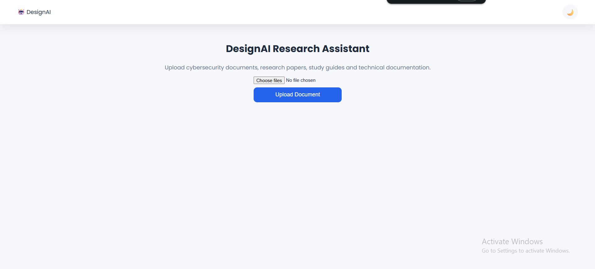
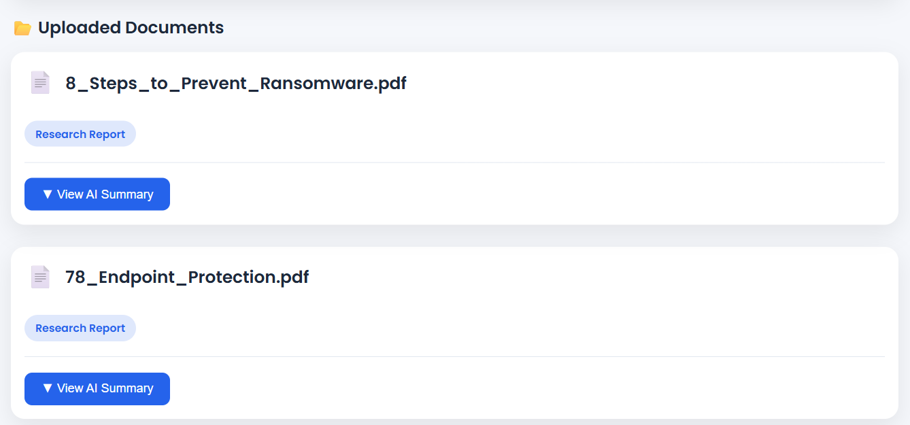
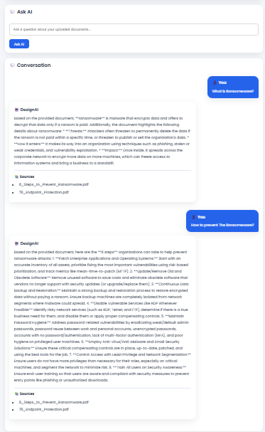
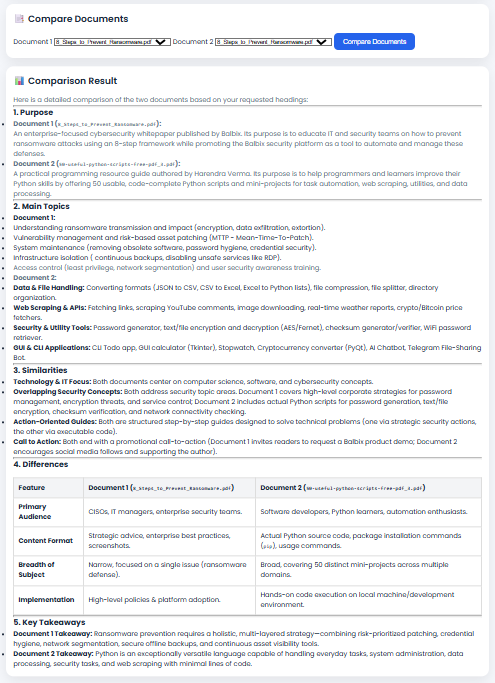
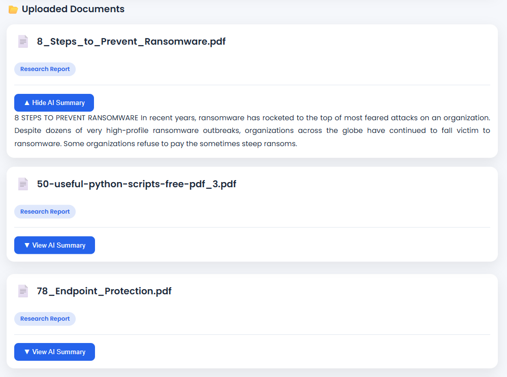

# DesignAI Research Assistant

An AI-powered Research Assistant built using Flask, TensorFlow, ChromaDB, Sentence Transformers, and Google Gemini.

The application allows users to upload one or more documents, automatically classify them using a TensorFlow model, generate AI summaries, ask questions using Retrieval-Augmented Generation (RAG), compare multiple documents, and analyze document metadata.

---

# Project Overview

The project processes uploaded documents through an AI pipeline.

Workflow:

Upload Documents
        │
        ▼
Extract Text
        │
        ▼
Clean Text
        │
        ▼
Chunk Text
        │
        ▼
Generate Embeddings
        │
        ▼
Store in ChromaDB
        │
        ▼
TensorFlow Classification
        │
        ▼
Gemini Summarization
        │
        ▼
Question Answering (RAG)
        │
        ▼
Document Comparison

---

# Features

## Supported File Types

- PDF
- DOCX
- TXT

## Document Management

- Upload one or more PDF documents
- Store document metadata
- Display uploaded documents
- Automatic preprocessing

## Document Processing

- PDF text extraction
- Text cleaning
- Intelligent chunking
- Embedding generation
- Vector indexing

## Semantic Search

- Sentence Transformer embeddings
- ChromaDB similarity search
- Retrieval of relevant document chunks

## AI Question Answering

- Retrieval-Augmented Generation (RAG)
- Answers generated only from uploaded documents
- Displays source documents
- Handles insufficient context gracefully

## Document Comparison

Compare two uploaded documents including:

- Similarities
- Differences
- Advantages
- Conclusions

## AI Summarization

Generates:

- Executive Summary
- Technical Summary
- Bullet Point Summary
- Key Takeaways

## TensorFlow Classification

Automatically classifies uploaded documents into predefined categories.

## Conversation Memory

Maintains chat history during the current session.

---

# Architecture Diagram

```
                    User
                      │
                      ▼
                 Flask Web App
                      │
     ┌────────────────┼────────────────┐
     ▼                ▼                ▼
 Upload Service   Chat Service   Compare Service
     │                │                │
     ▼                ▼                ▼
Text Extraction   Gemini API     Gemini API
     │
     ▼
Text Chunking
     │
     ▼
Sentence Transformer
     │
     ▼
ChromaDB
     │
     ▼
Relevant Chunks
     │
     ▼
Gemini Response
```

---

# Technology Stack

## Backend

- Python
- Flask

## Artificial Intelligence

- Google Gemini API
- TensorFlow
- Sentence Transformers

## Vector Database

- ChromaDB

## Document Processing

- PyMuPDF
- python-docx

## Frontend

- HTML
- CSS
- JavaScript

---

# Project Structure

```
designai-research-assistant/
│
├── app/
│   ├── api/
│   ├── pipeline/
│   ├── services/
│   ├── static/
│   ├── templates/
│   ├── tensorflow/
│   ├── uploads/
│   ├── utils/
│   └── vector_db/
│
├── config/
├── data/
├── tests/
├── main.py
├── requirements.txt
├── README.md
├── .env.example
└── .gitignore
```

---

# Installation

Clone the repository

```bash
git clone https://github.com/PenumatsaRohithVenkataSaiPhaniVarma/designAi-research-assistant.git
```

Go into the project

```bash
cd designai-research-assistant
```

Create virtual environment

```bash
python -m venv venv
```

Activate

Windows

```bash
venv\Scripts\activate
```

Install dependencies

```bash
pip install -r requirements.txt
```

---

# Environment Variables

Create a `.env` file.

Example:

```env
GEMINI_API_KEY=YOUR_GEMINI_API_KEY
```

---

# Running the Project

```bash
python main.py
```

Open:

```
http://127.0.0.1:5000
```

---

# API Endpoints

| Endpoint | Method | Description |
|----------|--------|-------------|
| / | GET | Home Page |
| /upload | POST | Upload Documents |
| /ask | POST | Ask AI Questions |
| /compare | POST | Compare Documents |

---
# API Endpoints

(table...)

--------------------------------

# API Documentation

GET /

...

POST /upload

...

POST /ask

...

POST /compare

...

--------------------------------

# Design Decisions

- Flask for lightweight web development.
- ChromaDB for semantic vector search.
- Sentence Transformers for embedding generation.
- Google Gemini for summarization and question answering.
- TensorFlow for document classification.
- Modular architecture to separate API, services, utilities, and pipeline logic.

---

# Assumptions

- Documents are primarily PDF files.
- Internet connection is required for Gemini API.
- API key is provided through `.env`.

---

# Limitations

- Supports text-based documents only.
- OCR for scanned PDFs is not implemented.
- Authentication and multi-user support are not included.

---

# Future Improvements

- OCR support
- Hybrid Search (BM25 + Vector Search)
- Authentication
- Docker Deployment
- Cloud Deployment
- Analytics Dashboard
- Streaming AI Responses

---

# Screenshots

## Home Page

---
## Upload Documents

---
## AI Chat

---
## Document Comparison

---
## Generated Summary

---

# Author

**Rohith Venkata Sai Phani Varma**

BCA Student

AI Research Assistant Project